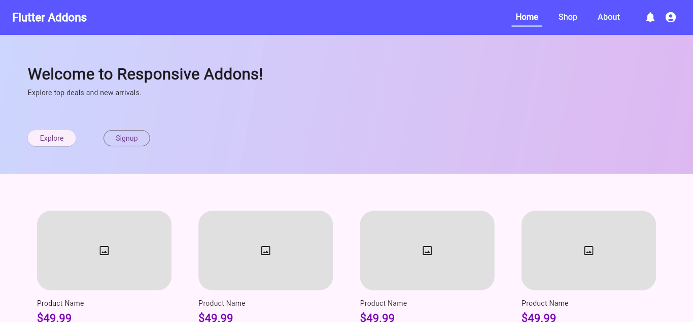

<div align="center">
  
</div>

# Responsive Addons


A powerful Flutter package offering **responsive UI utilities** and a **Bootstrap-style grid system** for building adaptable layouts across all screen sizes and devices.

> **`responsive_addons`** is a standalone module extracted from the [`flutter_addons`](https://github.com/arrahmanbd/flutter_addons) framework.  
> It focuses solely on responsive layout and scaling utilities—making it lightweight, modular, and easy to integrate into any Flutter project.  
> 📦 [View on pub.dev »](https://pub.dev/packages/flutter_addons)


[](https://pub.dev/packages/flutter_addons)

It focuses solely on responsive utilities and layout tools—making it lightweight, modular, and easy to integrate into any Flutter project.

<p align="center">
  
</p>

---

## ✨ Key Features

- ⚙️ `ResponsiveApp`: Simplified entry point for scaling apps based on design size or device dimensions
- 📐 Responsive units: Use intuitive units like `ph`, `pw`, `sp`, `dp`, `cm`, `inches`, and more
- 📏 Design-based scaling: Reflects original Figma/Adobe XD designs in responsive layouts
- 💬 MediaQuery Breakpoints: `context.isXs`, `isMd`, `isLg`, etc., for responsive conditions
- 🎛 Bootstrap-style layout: Rows, columns, offsets, visibility utilities
- 🧱 Grid system with nesting and offsets
- 🎨 Clean and modular extension-based API

---

## 🚀 Getting Started

### 🔧 Initialization

Wrap your app with `ResponsiveApp` to enable responsive scaling and layout behaviors:

```dart
ResponsiveApp(
  builder: (context, orientation, screenType) {
    return const MyApp();
  },
  designSize: Size(375, 812), //Optional
  errorScreenStyle: ErrorScreenStyle.dessert,
);
````

---

## 📐 Responsive Units

Add `.ph`, `.pw`, `.sp`, `.dp`, `.cm`, etc., to any number for expressive responsive layouts:

| Unit       | Description                         | Example                      |
| ---------- | ----------------------------------- | ---------------------------- |
| `50.ph`    | 50% of screen height                | `SizedBox(height: 50.ph)`    |
| `25.pw`    | 25% of screen width                 | `SizedBox(width: 25.pw)`     |
| `14.sp`    | Responsive font size                | `TextStyle(fontSize: 14.sp)` |
| `16.dp`    | Density-independent pixels          | `EdgeInsets.all(16.dp)`      |
| `2.inches` | Absolute inch unit (1 inch = 96 px) | `SizedBox(height: 2.inches)` |
| `10.vmin`  | % of the smaller screen dimension   | `Container(width: 10.vmin)`  |
| `8.r`      | Radius based on screen width        | `BorderRadius.circular(8.r)` |

---

## 📏 Design-Based Scaling

Perfect when working with fixed design specs:

| Expression          | Description                      | Example                                              |
| ------------------- | -------------------------------- | ---------------------------------------------------- |
| `100.w`             | Width based on reference design  | `Container(width: 100.w)`                            |
| `50.h`              | Height based on reference design | `Container(height: 50.h)`                            |
| `16.ts`             | Typography scale                 | `TextStyle(fontSize: 16.ts)`                         |
| `12.verticalSpace`  | Adds vertical spacing            | `Column(children: [12.verticalSpace])`               |
| `8.horizontalSpace` | Adds horizontal spacing          | `Row(children: [Icon(), 8.horizontalSpace, Text()])` |

---

## 🧩 Breakpoint Utilities

Use extensions on `BuildContext` to apply screen-aware logic:

```dart
if (context.isXs) {
  print("Extra small screen");
} else if (context.isLg) {
  print("Large screen layout");
}
```

| Breakpoint | Width Range      | Description          |
| ---------- | ---------------- | -------------------- |
| `isXs`     | `< 576px`        | Extra small devices  |
| `isSm`     | `576px - 767px`  | Small phones         |
| `isMd`     | `768px - 991px`  | Medium tablets       |
| `isLg`     | `992px - 1199px` | Large desktops       |
| `isXl`     | `≥ 1200px`       | Extra-large displays |

---

## 🧱 Bootstrap-Style Grid Layout

Create rows and columns just like in Bootstrap:

```dart
Row(
  children: [
    Col(xs: 6, child: Container(color: Colors.red)),
    Col(xs: 6, offset: 2, child: Container(color: Colors.blue)),
  ],
)
```

### Bonus Grid Features:

* ✅ `ColOffset`: Align columns with visual spacing
* 📦 `GridContainer`: Centered container with max-width
* 👁️ Breakpoint-based visibility (`HiddenOn.sm`, `VisibleOn.lg`)
* 🔁 Nested Rows: Responsive layout within layout

---

## 📦 Installation

Add to your `pubspec.yaml`:

```yaml
dependencies:
  responsive_addons: ^1.0.0
```

Then run:

```sh
flutter pub get
```

---

## 📚 Documentation

Full documentation available on [GitHub](https://github.com/your_username/responsive_addons#readme) (replace with actual link).

---

## 🤝 Contributing

Feel free to open issues or pull requests. Let's make responsive UI easier for all Flutter devs!

---

## 📄 License

MIT License. See [`LICENSE`](./LICENSE) for details.

